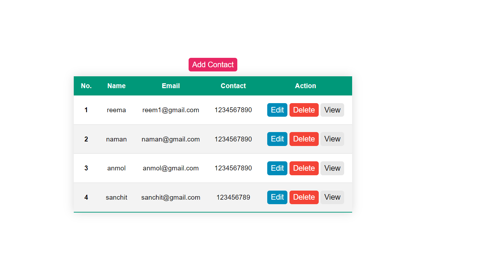

# CRUD Operations in React, Node.js, Express, and MySQL

[](http://localhost:3000)

This project showcases a CRUD (Create, Read, Update, Delete) operation implementation using React JS, Node.js, Express JS, and MySQL. It manages multiple records and provides functionalities to Create, Read, Update, and Delete records.

## Functionality
- **CREATE:** Allows users to add new records.
- **READ:** Enables viewing existing records.
- **DELETE:** Provides the ability to remove unwanted records.
- **UPDATE:** Allows modification of existing records.

## Project Setup

### Frontend
To run the frontend of the application, follow these steps:

1. **Navigate to the Client directory:**
    ```
    cd Client
    ```

2. **Install dependencies:**
    ```
    npm install
    ```

3. **Start the application in development mode:**
    ```
    npm start
    ```

4. **Access the application:**
    Open [http://localhost:3000](http://localhost:3000) in your browser.

### Backend
To run the backend of the application, follow these steps:

1. **Move to the Server directory:**
    ```
    cd Server
    ```

2. **Install necessary packages:**
    ```
    npm install
    ```

3. **Start the backend server:**
    ```
    npm run server
    ```

**Note:** Ensure that your MySQL server is properly configured and connected for the application to function correctly.

## Database Configuration
Ensure your MySQL database configuration is updated in the project files to establish a proper connection between the backend and the MySQL server.

## Additional Notes
- Make sure to maintain the necessary environment variables and configurations for both frontend and backend environments.
- Troubleshoot any connection or dependency issues by checking the logs or error messages displayed in the console.

Feel free to explore the codebase and customize it as per your requirements!

---

This `README.md` provides a comprehensive guide to setting up and running the project. For any further details or troubleshooting, refer to the relevant sections above. Happy coding!
